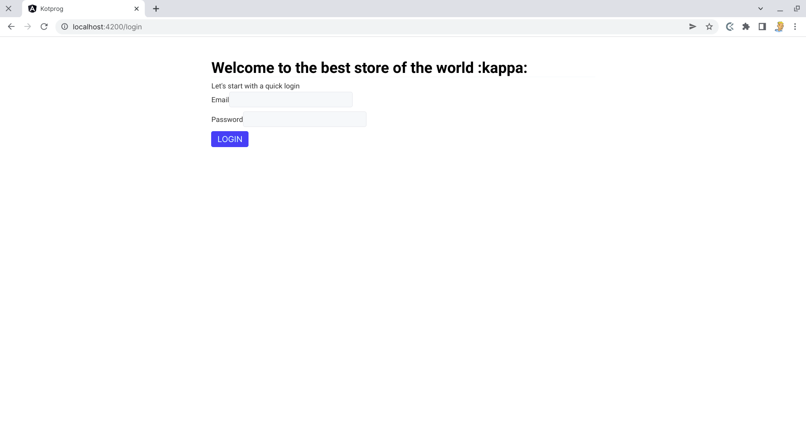
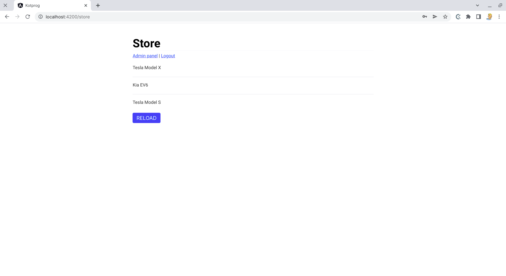
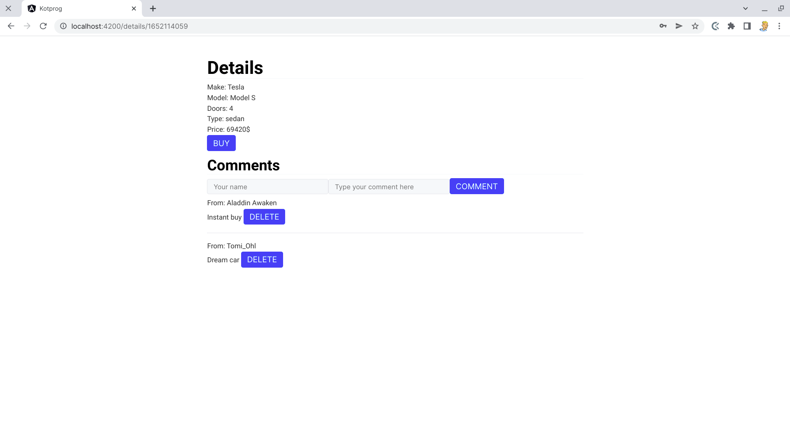
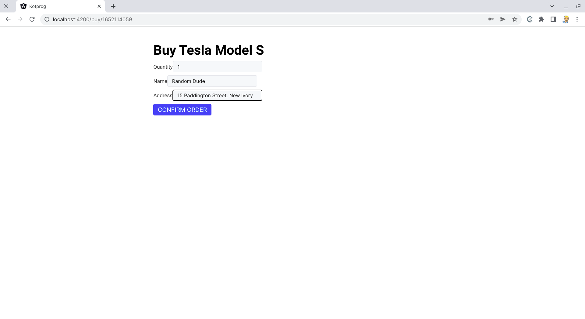
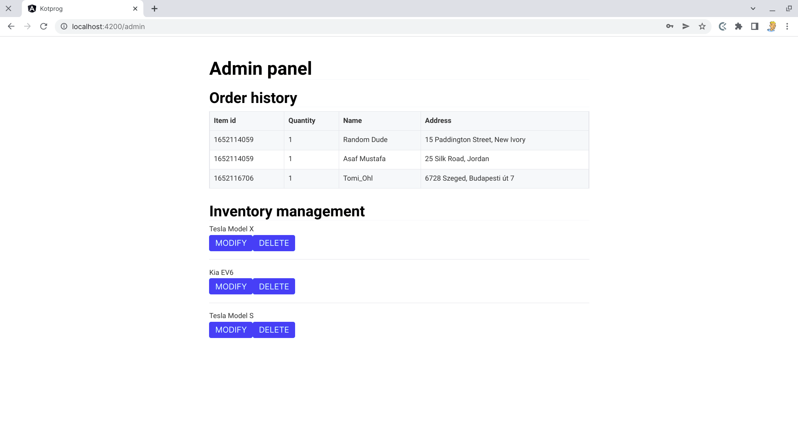

# PRF Shop

## Hosting

The webapp is hosted under the following url: [https://prf-shop.web.app](https://prf-shop.web.app)

## Running locally

### Prerequisites

Create `src/environments/enviromnent.ts` according to the example file found in the same folder and fill in your firebase credentials.

### Development server

Run `ng serve` for a dev server. Navigate to `http://localhost:4200/`. The application will automatically reload if you change any of the source files.

### Build

Run `ng build` to build the project. The build artifacts will be stored in the `dist/` directory.

## Development history

- spring 2022: Programrendszerek fejlesztése course at SZTE
- beginning of May, 2022: planning the overall features
- 2 days before deadline: quick review of the course
- 1 day before deadline: firebase auth, login, basic store component (list of items)
- the final day: store component, details component with a comments section, buy feature, admin panel, designing everything and deploying to firebase

Since I left this for the last minute the amount of time was the biggest obstacle. I did what I could. Another big barrier was the fact that it's not trivial to get a firebase document's auto-generated ID based on it's contents, and also that where clauses didn't want to work at first.

## Screenshots

### Login

Login with your data. This will only let you in if you provide a valid user's email and password.

### Store

List items. Click on them to see their details.

### Details

See others' comments and write your own. Click buy to create an order.

### Buy

Order form: fill in the required data and click the blue button to confirm.

### Admin page

List all the buy orders on the page as well as the inventory. Manage them using buttons.

